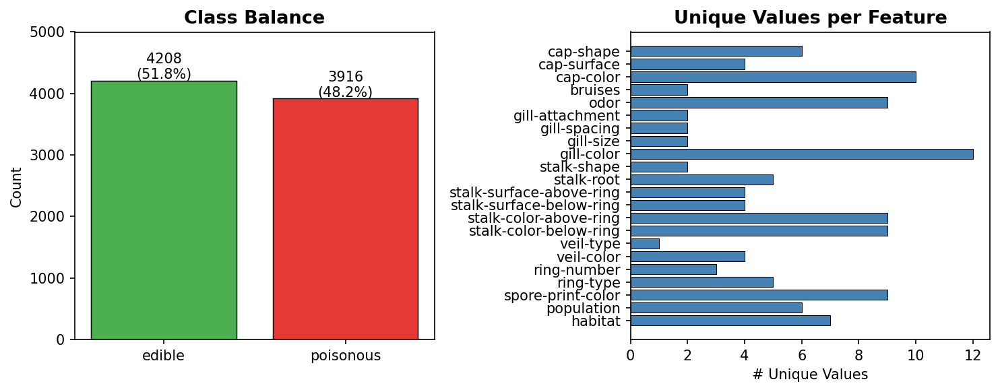
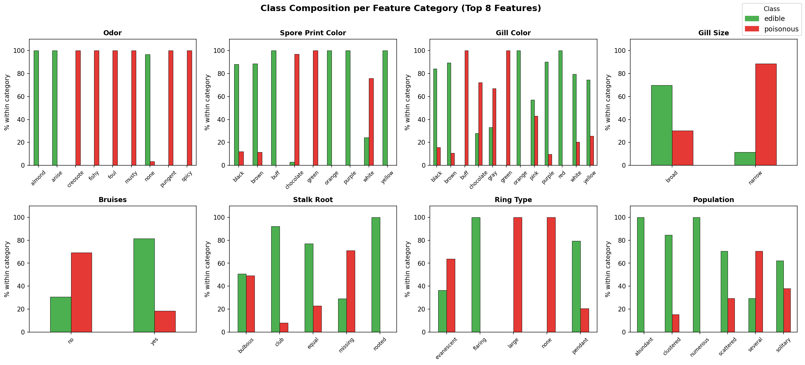
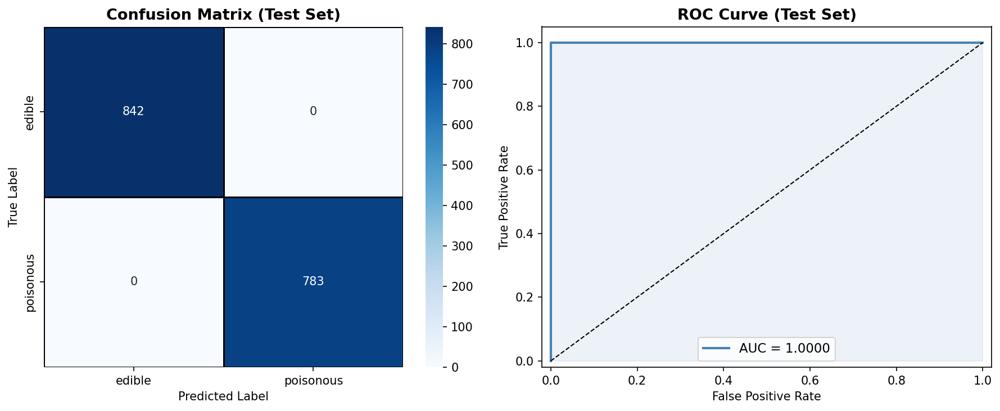
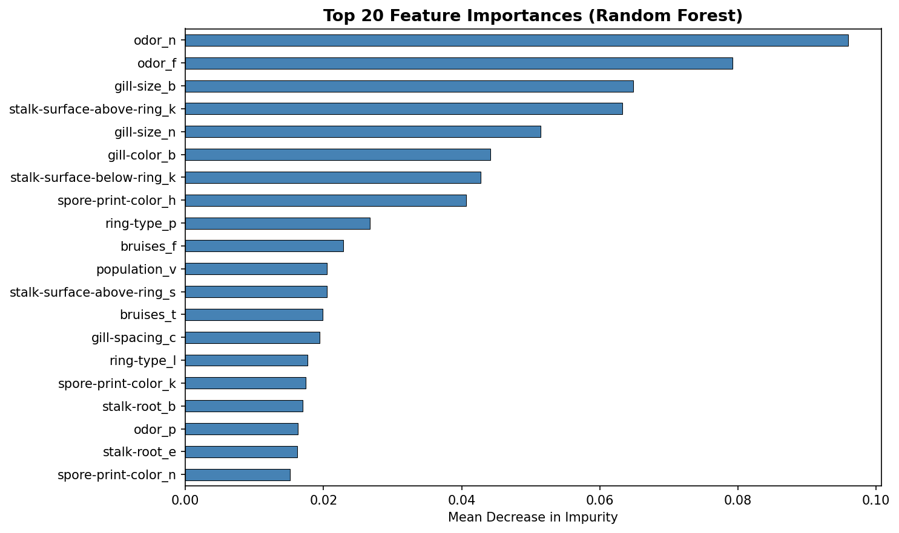

# Mushroom Edibility Classification

**This repository holds an attempt to classify mushrooms as edible or poisonous using a Random Forest on the UCI Mushroom dataset from the [Kaggle Mushroom Classification challenge](https://www.kaggle.com/datasets/uciml/mushroom-classification).**

---

## Overview

**Task:** Given 22 categorical physical features of a mushroom (cap shape, odor, gill color, spore print color, etc.), predict whether it is **edible** or **poisonous**. This is a binary classification task where a false negative (predicting edible when actually poisonous) is safety-critical.

**Approach:** The problem is formulated as a supervised binary classification task. All 22 features are categorical (letter-coded), so the pipeline performs one-hot encoding followed by a Random Forest classifier. A single feature, *odor*, is identified as the dominant predictor through visualization and confirmed by feature importance rankings.

**Performance:** The Random Forest achieves **100% accuracy, AUC-ROC = 1.0, and MCC = 1.0** on both the held-out validation and test sets. This perfect separation is consistent with published results on this dataset, which has a highly structured feature space despite the field guide's warning that "there is no simple rule" for edibility.

---

## Summary of Workdone

### Data

- **Type:** CSV file of categorical features; binary target in first column.
- **Size:** 8,124 rows × 23 columns (22 features + 1 target); file is ~366 KB.
- **Instances:**
  - Train: 5,524 (68%)
  - Validation: 975 (12%)
  - Test: 1,625 (20%)
  - All splits are stratified to preserve the class ratio (~52% edible / 48% poisonous).

#### Preprocessing / Clean Up

| Step | Action | Reason |
|---|---|---|
| Drop `veil-type` | Removed | Zero variance — all 8,124 rows are `p` (partial) |
| Encode target | `e` → 0, `p` → 1 | Standard binary format |
| `stalk-root` `?` | Kept as its own category | Informative per field guide; not a data entry error |
| One-hot encode | 21 features → 116 binary columns | Required for RF; avoids ordinal assumption |
| Rescaling | None | RF is scale-invariant; all OHE columns are binary |

#### Data Visualization



The dataset is nearly balanced (4208 edible / 3916 poisonous), so no resampling or class weighting is needed.



**Key finding:** *Odor* perfectly separates most classes — foul, pungent, creosote, musty, spicy, and fishy odors are 100% poisonous; almond and anise are 100% edible. Only mushrooms with no odor are mixed. *Spore-print-color* green and buff are also 100% poisonous.

### Problem Formulation

- **Input:** 116 binary one-hot encoded features derived from 21 original categorical features.
- **Output:** Binary label — 0 (edible) or 1 (poisonous).
- **Model:** `RandomForestClassifier` (scikit-learn)
  - `n_estimators=200` — stable ensemble with fast training time
  - `max_depth=None` — trees grow to full depth; bagging prevents overfitting
  - `random_state=42` — reproducible results
- **No explicit loss function tuning** — RF optimizes Gini impurity internally.

### Training

- **Software:** Python 3.11, scikit-learn 1.x, pandas, matplotlib, seaborn.
- **Hardware:** CPU only (no GPU required — tree ensembles on 8K rows train in < 5 seconds).
- **Training time:** ~3 seconds on a modern laptop CPU.
- **Stopping criterion:** N/A — Random Forest trains in one pass (no iterative epochs).
- **Difficulties:** None. The dataset is clean and well-structured.

### Performance Comparison

**Key metrics:**

| Split | Accuracy | AUC-ROC | MCC |
|---|---|---|---|
| Validation (n=975) | **1.0000** | **1.0000** | **1.0000** |
| Test (n=1,625) | **1.0000** | **1.0000** | **1.0000** |



Zero misclassifications on 2,600 total held-out samples.



`odor_none` and `odor_foul` are the top two features, together accounting for the largest share of mean decrease in impurity.

### Conclusions

- Mushroom edibility is **completely predictable** from physical characteristics using a Random Forest — even though no simple single-feature rule exists, their combination is perfectly separable.
- **Odor** is the single most important predictor; its encoding alone nearly solves the problem.
- Treating `stalk-root` `?` as its own category (rather than imputing or dropping) is the correct strategy given its domain meaning.
- 100% accuracy on this dataset is well-documented in the literature and not a sign of leakage or overfitting.

### Future Work

- Compute **SHAP values** to generate interpretable, per-prediction explanations — critical for safety-sensitive applications.
- Find the **minimal feature subset** (likely just odor + 1–2 others) that preserves ≥ 99.9% accuracy, enabling a practical field identification rule.
- Test a **Logistic Regression** baseline to see if linear separability holds.
- Evaluate **noise robustness** by randomly flipping feature values and measuring accuracy degradation.
- Extend to **real-world image data** paired with these tabular features for multi-modal classification.

---

## How to Reproduce Results

### Overview of files in repository

```
.
├── mushrooms.csv                  # Raw dataset (download from Kaggle link above)
├── Mushroom_Classification.ipynb  # Main notebook: EDA → cleaning → training → evaluation
├── README.md                      # This file
└── UTA-DataScience-Logo.png       # Logo (optional)
```

### Software Setup

Install required packages:

```bash
pip install pandas numpy scikit-learn matplotlib seaborn jupyter
```

All packages are standard and available on PyPI. No special hardware is required.

### Data

1. Download `mushrooms.csv` from [Kaggle](https://www.kaggle.com/datasets/uciml/mushroom-classification).
2. Place the file in the same directory as the notebook.
3. No additional preprocessing is required before running the notebook.

### Training

Open and run all cells in `Mushroom_Classification.ipynb` in order:

```bash
jupyter notebook Mushroom_Classification.ipynb
```

The notebook is fully self-contained and runs top-to-bottom without external state.

#### Performance Evaluation

Performance metrics (accuracy, AUC-ROC, MCC, confusion matrix, ROC curve) are computed and displayed in Section 4.3–4.4 of the notebook. No separate evaluation script is needed.

---

## Citations

- Schlimmer, J. (1987). *Mushroom Records drawn from The Audubon Society Field Guide to North American Mushrooms.* UCI Machine Learning Repository. https://archive.ics.uci.edu/ml/datasets/mushroom
- Lincoff, G. (1981). *The Audubon Society Field Guide to North American Mushrooms.* Alfred A. Knopf.
- Dua, D. and Graff, C. (2019). UCI Machine Learning Repository. University of California, Irvine. http://archive.ics.uci.edu/ml
- Pedregosa et al. (2011). Scikit-learn: Machine Learning in Python. *JMLR* 12, pp. 2825–2830.
